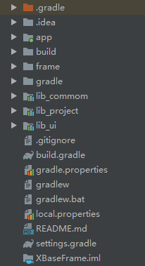

#框架结构说明#




```
app: 项目工程代码（用于展示和测试框架库的效果）

lib_project: 项目开发基础库,可以在这里对其他的依赖库做一些封装和初始化设置,也可以放置一些通用的资源。

lib_common: 基础工具库，封装了各种util工具，如log日志,权限请求,通用适配器等等

lib_ui: 基础UI库，封装了各种自定义View

```

>
>在本项目工程中,app 里依赖了 lib_project。 lib_project里依赖了 lib_common 和 lib_ui。
>在实际开发中可以可以自行去构建项目目录或者直接依赖lib_common、lib_ui等框架库